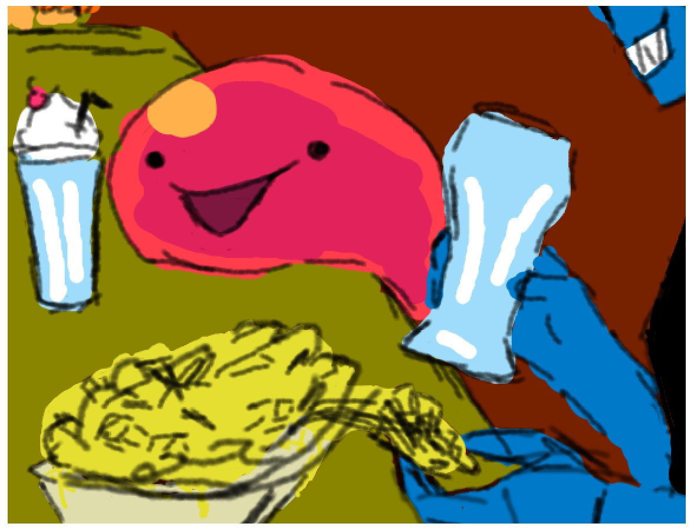
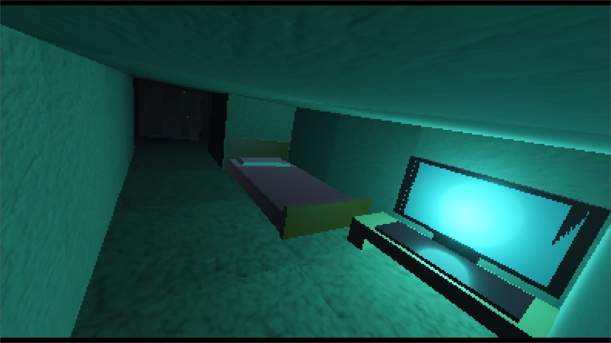
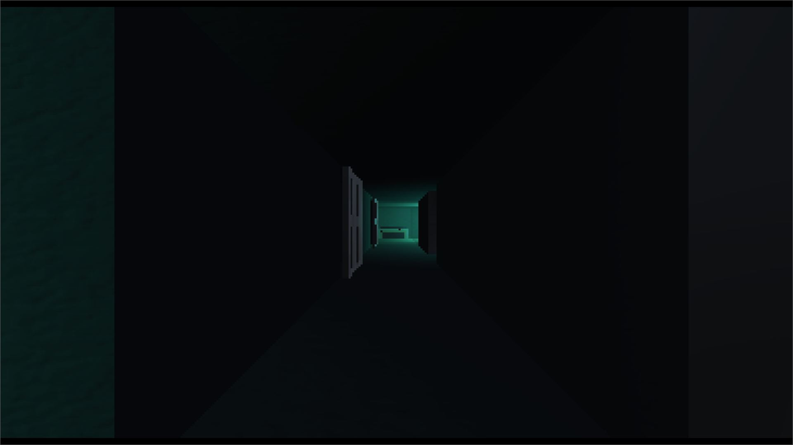
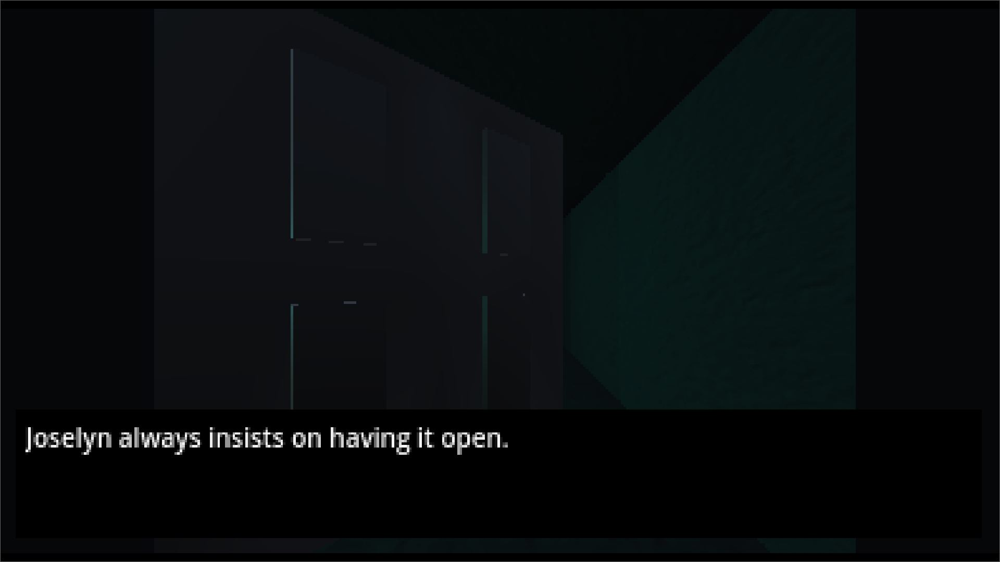
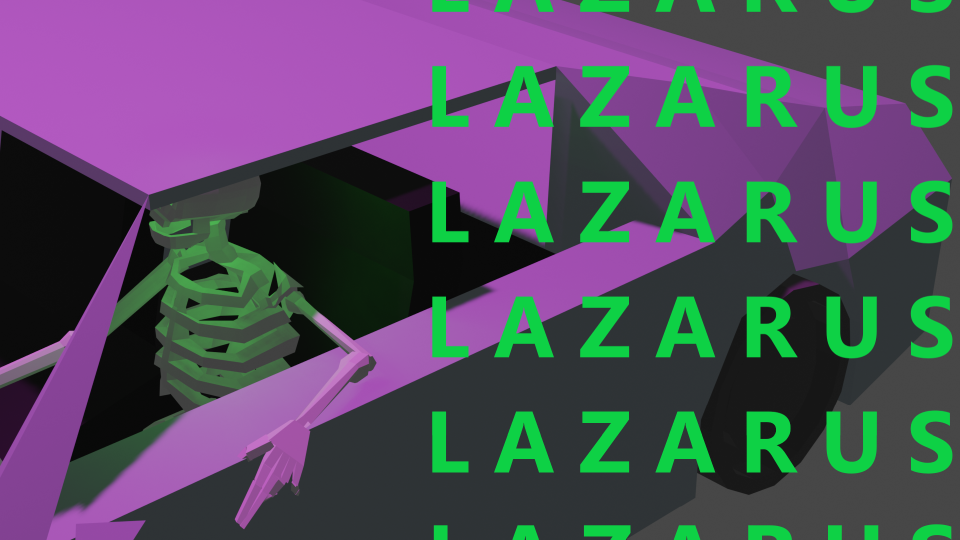
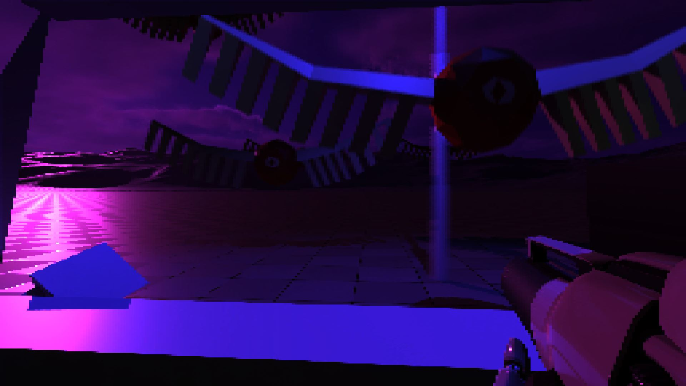
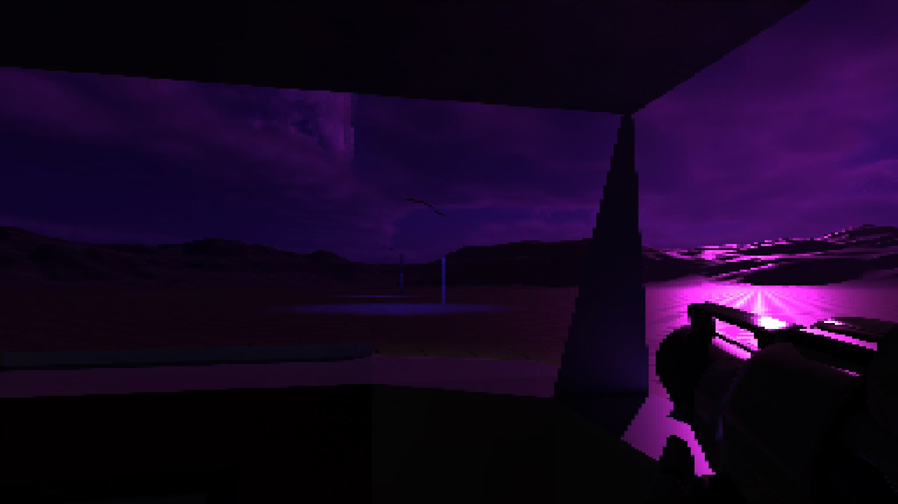

# Games!
This is a little space for me to document some stuff about some of the games I've made. Organized from newest (top) to oldest (bottom).

## Slime Hop

<iframe width="560" height="315" src="https://www.youtube.com/embed/zMh9ywE4fVI?si=XsNISW1SYRJICtf7" title="YouTube video player" frameborder="0" allow="accelerometer; autoplay; clipboard-write; encrypted-media; gyroscope; picture-in-picture; web-share" allowfullscreen></iframe>

Currently being made with Godot **4.1.1**, it's still a work in progress! Unlike most of my games, it's a group project with a few other people from the Game Development Club at my school. My contributions so far aren't huge, mainly just the implementation of buttons and blocks, and a silly little undertale reference level.

I'm really proud of the Undyne fight level, because I feel like I took the good parts of the sans level in No Leg Up but changed the parts that I didn't like (thanks to the people who playtested that sans level, btw). It has a health mechanic, much more content, and it's organized better in godot's file system as well as being just generally coded a bit better I think. I'm also much more proud of the artwork I put into it, even though it's still pretty rough haha

## The Midnight Oil

Made with Godot **4.1.1** for a Halloween Jam for my school's Game Dev Club. I made it in godot because I like godot and I know how to use it well-ish enough to put something together in the like day that I had to work on it.

It's my first ever horror game and I tried my best to base it on what I find scary, personally. Visually it was inspired a lot by *Inscryption* and I think that came across well. Like I accomplished what I sought out to with the game, but I'm not really satisfied with the end result as a whole because I feel like it's not a very fun *game* and that it ends pretty abruptly.

<iframe width="560" height="315" src="https://www.youtube.com/embed/Ck_h3ERMd_Y?si=M6t4vAvHFQ6Eirrz" title="YouTube video player" frameborder="0" allow="accelerometer; autoplay; clipboard-write; encrypted-media; gyroscope; picture-in-picture; web-share" allowfullscreen></iframe>
{: style="width:48%;"}
{: style="width:48%;"}

[:fontawesome-brands-itch-io: Play The Midnight Oil on itch.io](https://jollista.itch.io/the-midnight-oil){ .md-button }

## Lazarus

Made with **Unreal 5**, a game about undead at the end of the world. I made it for the Summer Slow Jams 2023 Narrative jam as an excuse to learn Unreal. I also got to learn a bunch about how to use Blender, which was incredibly fun. Half of the game's music was made by [@summer_cashier](https://twitter.com/summer_cashier)!

I really want to use Unreal more, but I haven't quite had the time for it in addition to the projects I'm already working on. In the meantime, though, I've been practicing C++ a lot more so I can be more confident when I get to work more in Unreal.

<iframe width="560" height="315" src="https://www.youtube.com/embed/BDJeg5kPOnU?si=TICUooPvmmgUeXGS" title="YouTube video player" frameborder="0" allow="accelerometer; autoplay; clipboard-write; encrypted-media; gyroscope; picture-in-picture; web-share" allowfullscreen></iframe>
{: style="width:48%;"}
{: style="width:48%;"}
{: style="width:48%;"}
{: style="width:48%;"}

[:fontawesome-brands-itch-io: Play Lazarus on itch.io](https://jollista.itch.io/lazarus){ .md-button }

## No Leg Up
Made with **Godot 4** for my school's Game Development Club, and my first successful group game project. The initial concept was a "no legs platformer" where you shift gravity instead of jumping and walking and stuff. It was originally supposed to be more of a puzzle platformer, but it ended up being more about precision, owing to a lot of inspiration from Celeste. 

I made all the levels as well all the art for the sansundertale level, and like half of the mechanics. I've been told it's very hard, and that's partly because the player's velocity isn't capped, but we never got around to implementing a terminal velocity. Also for the sans level since it's just one hit and you're dead it's even more difficult. Even still, I'm a little disappointed in my own lack of content with that because there's no ending reward or anything, so it's a bit anticlimactic.

<iframe width="560" height="315" src="https://www.youtube.com/embed/uJvrjdpbtO0?si=29jeI6uWHHzhtDF-" title="YouTube video player" frameborder="0" allow="accelerometer; autoplay; clipboard-write; encrypted-media; gyroscope; picture-in-picture; web-share" allowfullscreen></iframe>

[:fontawesome-brands-itch-io: Play No Leg Up on itch.io](https://the64threalm.itch.io/no-leg-up){ .md-button }

## Queenmaker
Made with **Godot 4** for a game jam I didn't have time for, it's a barely functional game that I delisted from itch because it sucks. The only part about it that I at all was even somewhat ok with was the narrative, but even then it was just a lame Hollow Knight knockoff.

Still, I did win $50 because of it, so that's cool.