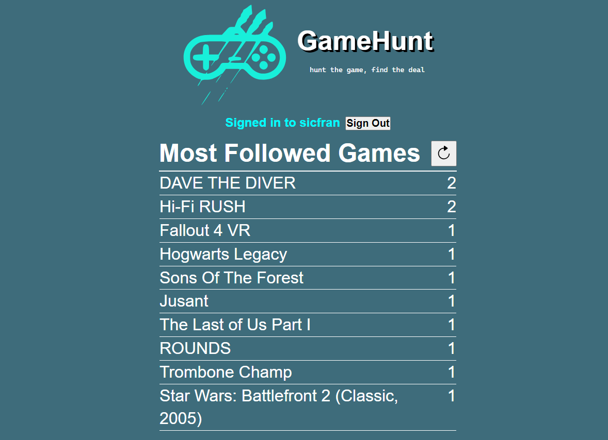

---
hide:
  - navigation
---

# Hello!
## About
My name is Juniper. This website contains a non-exhaustive list of projects I've worked on.

## Software
A collection of miscellaneous software projects.

### DATA.POOL
*Solo dev | NodeJS*

[DATA.POOL](https://jollista.github.io/DATA.POOL/) is a discord bot assistant for Cyberpunk RED, a tabletop roleplaying game. Made using NodeJS and Discord's API. Hosted on Cloudflare using GitHub Actions for continous integration.

{: style="width:49%"}
{: style="width:49%"}

### GameHunt
*Three person team | NextJS*

[GameHunt](https://game-hunt.vercel.app/) is a web app for tracking when games go on sale across multiple storefronts. My contributions were mostly in regards to the followed games page. Originally hosted on AWS, team pivoted to Vercel for ease of CI.

{: style="width:47%"}
{: style="width:51%"}

### FLATLINE
*Solo dev | HTML, JavaScript*

[FLATLINE](https://jollista.github.io/Flatline/) is a character creation helper website for Cyberpunk RED, a tabletop roleplaying game. Static website hosted by GitHub Pages.

## Games
A collection of games.

### Delve
*Solo dev | Godot 4*

A small text-based adventure game inspired by Dungeons & Dragons. Made for the [Brackeys Game Jam 2024.1](https://itch.io/jam/brackeys-11/rate/2534671) over the course of one week.

<iframe width="560" height="315" src="https://www.youtube.com/embed/NqYoIbwtjBw?si=PTz8mqlgsYsFhlc3" title="YouTube video player" frameborder="0" allow="accelerometer; autoplay; clipboard-write; encrypted-media; gyroscope; picture-in-picture; web-share" allowfullscreen></iframe>

### Untitled
*Solo dev | Unreal 5*

An untitled and unfinished project made to experiment with movement mechanics in a first-person perspective in the Unreal Engine.

<iframe width="560" height="315" src="https://www.youtube.com/embed/S9-B1VsLV2Y?si=nPUzUG2k-fCaBeqe" title="YouTube video player" frameborder="0" allow="accelerometer; autoplay; clipboard-write; encrypted-media; gyroscope; picture-in-picture; web-share" allowfullscreen></iframe>

### Slime Hop
*Five person team | Godot 4*

A simple puzzle platformer. My contributions included a signal-based implementation of buttons and toggleable platforms, and an extended boss fight level in a different style than the rest of the game.

<iframe width="560" height="315" src="https://www.youtube.com/embed/zMh9ywE4fVI?si=crpYtrVOLFOxvWx3" title="YouTube video player" frameborder="0" allow="accelerometer; autoplay; clipboard-write; encrypted-media; gyroscope; picture-in-picture; web-share" allowfullscreen></iframe>

### The Midnight Oil
*Solo dev | Godot 4*

A narrative horror game made in a day and a half for a Halloween Game Jam.

<iframe width="560" height="315" src="https://www.youtube.com/embed/Ck_h3ERMd_Y?si=lzxrDjjsoisoNYyR" title="YouTube video player" frameborder="0" allow="accelerometer; autoplay; clipboard-write; encrypted-media; gyroscope; picture-in-picture; web-share" allowfullscreen></iframe>

### Lazarus
*Solo dev | Unreal 5*

A first attempt at a first-person shooter in a new engine, made for a Game Jam over the course of two weeks.

<iframe width="560" height="315" src="https://www.youtube.com/embed/BDJeg5kPOnU?si=Sri_TEuuIR89DIZL" title="YouTube video player" frameborder="0" allow="accelerometer; autoplay; clipboard-write; encrypted-media; gyroscope; picture-in-picture; web-share" allowfullscreen></iframe>

### No Leg Up
*Five person team | Godot 4*

A gravity-based precision platformer. Initial team effort waned after several weeks of development, so I took a hands-on leadership role and put most of the game together solo.

<iframe width="560" height="315" src="https://www.youtube.com/embed/uJvrjdpbtO0?si=41aZol4OybtU4e1q" title="YouTube video player" frameborder="0" allow="accelerometer; autoplay; clipboard-write; encrypted-media; gyroscope; picture-in-picture; web-share" allowfullscreen></iframe>

### Dockside
*Four person team | Unity*

A cozy game about fishing. Similar to No Leg Up which would follow, team effort waned shortly after the start of development so I took initiative and carried the game further into development.

{: style="width:48%;"}
{: style="width:48%;"}
{: style="width:96%;"}

## Links
[:fontawesome-brands-github: GitHub](https://github.com/Jollista/){ .md-button }
[:fontawesome-brands-itch-io: itch.io](https://jollista.itch.io/){ .md-button }